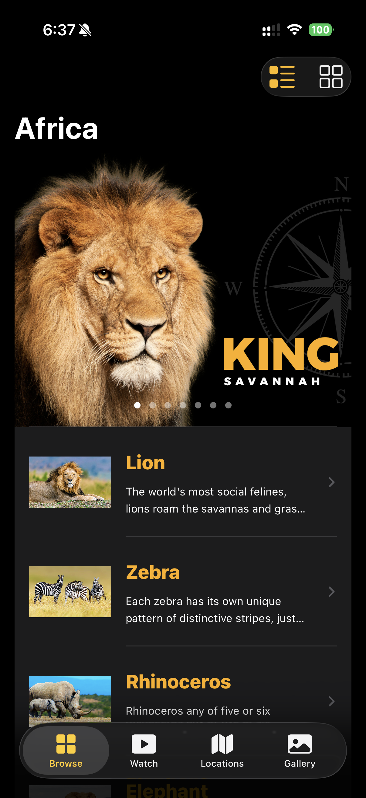
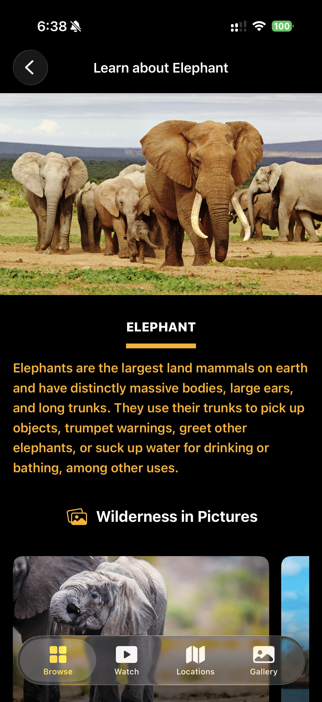
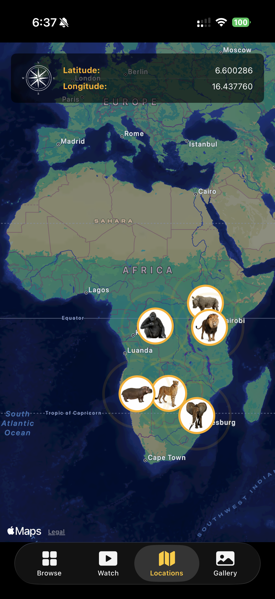
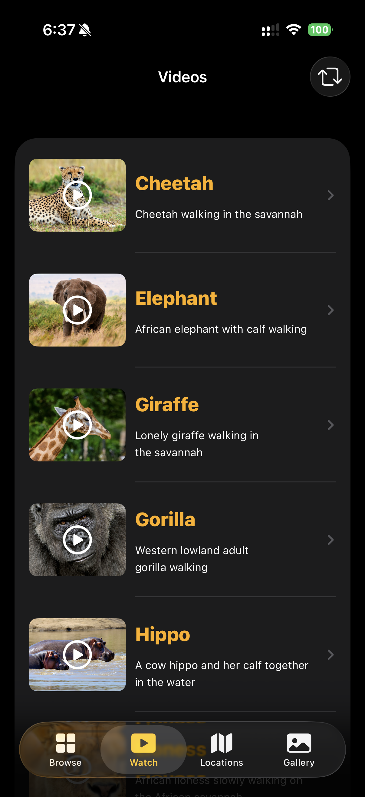
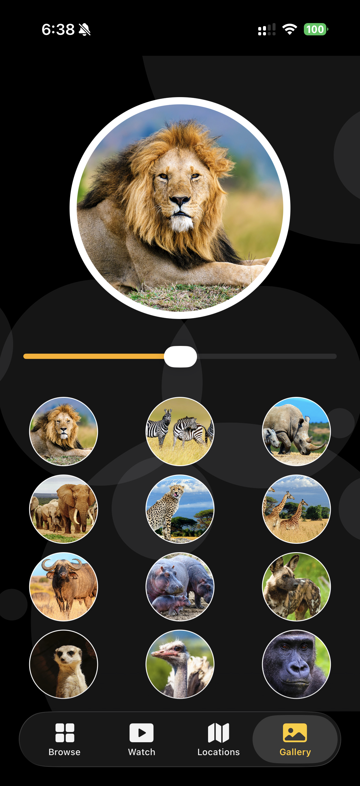
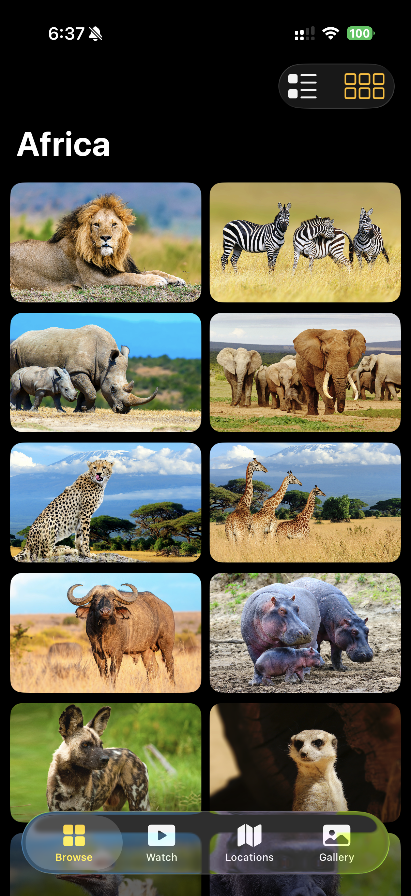
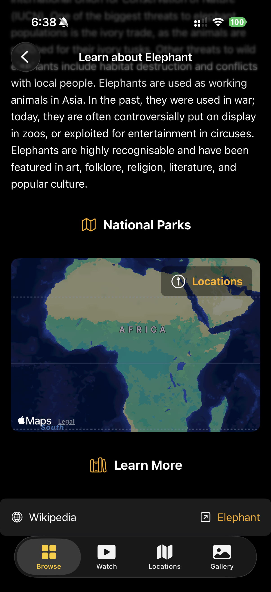
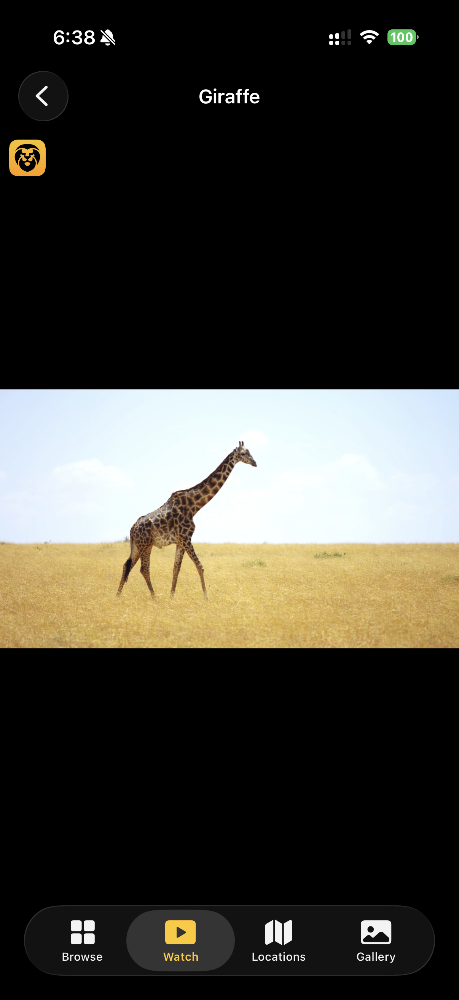
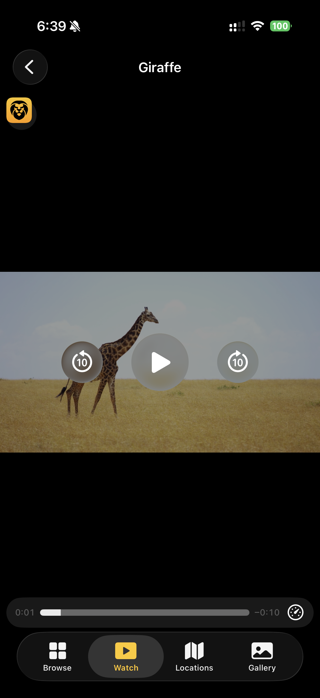

# Africa 🦁

Africa is a wildlife exploration iOS application built with SwiftUI. The app allows users to discover African animals through detailed profiles, beautiful images, wildlife videos, interactive maps, and photo galleries.

## Features

- Browse African wildlife in list and grid layouts
- View detailed information about each animal
- Explore animal photos in an interactive gallery
- Watch wildlife videos using a built-in video player
- View animal habitats and locations on a map
- Access additional information through Wikipedia
- Navigate between Browse, Watch, Locations, and Gallery sections
- Responsive dark-mode user interface
- Reusable SwiftUI components
- Smooth navigation and media playback

## App Screenshots

<p align="center">
  
  
  
</p>

<p align="center">
  
  
  
</p>

<p align="center">
  
  
  
</p>

## Demo Video

https://github.com/user-attachments/assets/e6751527-c83f-4afa-abc0-e9e202b0c82f

## Technologies Used

- Swift
- SwiftUI
- Xcode
- MapKit
- AVKit
- JSON
- iOS SDK

## What I Learned

While developing Africa, I learned how to build a complete multi-screen iOS application using SwiftUI.

This project helped me improve my understanding of:

- Creating reusable SwiftUI views and components
- Building list and grid layouts
- Implementing tab-based navigation
- Parsing and displaying local JSON data
- Integrating MapKit into a SwiftUI application
- Playing videos using AVKit
- Creating interactive image galleries
- Managing navigation between multiple screens
- Designing a consistent dark-themed user interface
- Organising an iOS project using models, views, components, and resources

## Project Structure

```text
Africa
├── Africa
│   ├── App
│   ├── Models
│   ├── Views
│   ├── Components
│   ├── Data
│   ├── Resources
│   └── Assets
├── AfricaTests
├── AfricaUITests
├── Stickers
├── assets
│   └── screenshots
└── README.md

### Main Project Folders

- **App** – Contains the main application entry point
- **Models** – Contains the animal, video, and location data models
- **Views** – Contains the main screens of the application
- **Components** – Contains reusable SwiftUI components
- **Data** – Contains local JSON data
- **Resources** – Contains videos and additional application resources
- **Assets** – Contains images, icons, and colours used in the application
- **AfricaTests** – Contains unit tests
- **AfricaUITests** – Contains user-interface tests

---

## Requirements

Before running the project, make sure you have:

- macOS
- Xcode
- Swift 5 or later
- iOS Simulator or a connected iPhone
- iOS 15 or later
- Git installed on your computer

---

## Getting Started

### 1. Clone the Repository

Open Terminal and run:

```bash
git clone https://github.com/DhruvPatel05/Africa.git
```

### 2. Open the Project Folder

```bash
cd Africa
```

### 3. Open the Project in Xcode

Open the `Africa.xcodeproj` file in Xcode.

You can also use the following command:

```bash
open Africa.xcodeproj
```

### 4. Select a Device

Select an iPhone simulator or a connected physical iPhone from the Xcode device menu.

### 5. Build and Run the Application

Run the app using:

```text
Command + R
```

You can also click the **Run** button in Xcode.

---

## How to Use the App

1. Launch the Africa application.
2. Browse African animals from the main screen.
3. Switch between list and grid layouts.
4. Select an animal to view its details.
5. Open the Watch tab to view wildlife videos.
6. Open the Locations tab to explore animals on the map.
7. Open the Gallery tab to view animal photographs.
8. Select the Wikipedia link to learn more about an animal.

---

## Repository

**GitHub Repository:**  
https://github.com/DhruvPatel05/Africa

---

## 👨‍💻 Author

**Dhruv Patel**

**LinkedIn:**  
https://www.linkedin.com/in/dhruv-patel-csm/

**GitHub:**  
https://github.com/DhruvPatel05

---

## Support

If you like this project, please consider giving it a star ⭐
